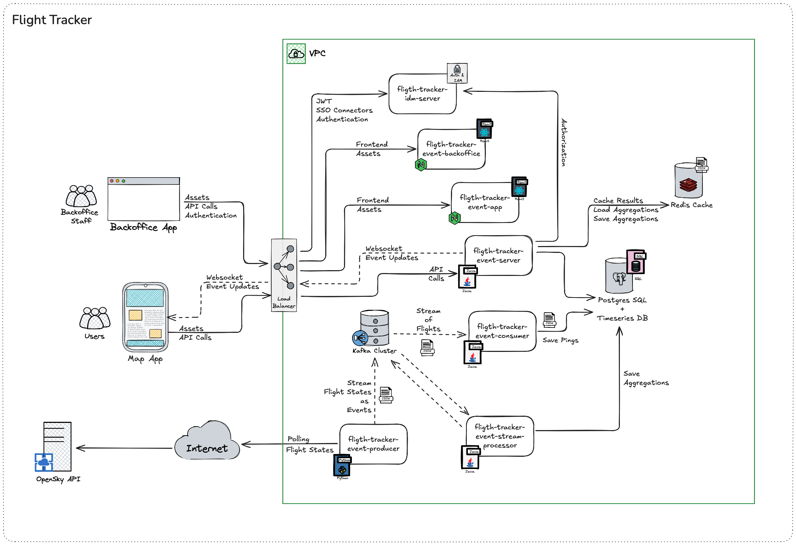

# Real-Time Flight Tracker

A distributed system for real-time flight tracking over Brazil, built with modern technologies and microservices architecture.

## Overview

This project implements a real-time flight tracking system that monitors aircraft movements over Brazilian airspace. The system processes flight data from OpenSky Network, performs real-time aggregations, and provides both user-facing and operational interfaces.



## Components

### Core Services

#### 1. flight-tracker-event-producer
- **Technology**: Python
- **Purpose**: Fetches real-time flight data from OpenSky Network API
- **Features**:
  - Configurable geographic boundaries for flight tracking
  - Kafka integration for event streaming
  - Docker support with crontab scheduling
- **Repository**: [flight-tracker-event-producer-python](https://github.com/luismr/flight-tracker-event-producer-python)

#### 2. flight-tracker-event-consumer
- **Technology**: Java 21 / SpringBoot
- **Purpose**: Validates and persists flight tracking events
- **Features**:
  - Message validation
  - Database persistence
  - Event processing pipeline

#### 3. flight-tracker-event-stream-processor
- **Technology**: Java 21 / SpringBoot
- **Purpose**: Generates and maintains flight tracking aggregations
- **Features**:
  - Real-time aggregations
  - Database updates
  - Performance optimizations

#### 4. flight-tracker-event-server
- **Technology**: Java 21 / SpringBoot
- **Purpose**: API and WebSocket server for flight tracking
- **Features**:
  - REST API endpoints
  - WebSocket broadcasting
  - Flight route history
  - Real-time flight status

### Frontend Applications

#### 5. flight-tracker-event-app
- **Technology**: TypeScript / React
- **Purpose**: User-facing flight tracking map interface
- **Features**:
  - Real-time flight visualization
  - Interactive map controls
  - WebSocket updates
  - Mobile-responsive design

#### 6. flight-tracker-event-backoffice
- **Technology**: TypeScript / React
- **Purpose**: Operational dashboard for staff users
- **Features**:
  - Flight ping monitoring
  - Aggregation views
  - System metrics
  - Administrative controls

### Infrastructure

#### 7. flight-tracker-idm-server
- **Technology**: Keycloak
- **Purpose**: Identity and access management
- **Features**:
  - SSO support
  - JWT authentication
  - Role-based authorization
  - User management

#### 8. Data Stores
- **Kafka**: Event streaming platform
- **Postgres + TimescaleDB**: Time-series data storage
- **Redis**: Caching and real-time data

#### 9. External Services
- **OpenSky API**: Public flight data source

## Project Structure

```
realtime-flight-tracker/
├── flight-tracker-event-producer/          # Python OpenSky data fetcher
├── flight-tracker-event-consumer/          # Java event consumer
├── flight-tracker-event-stream-processor/  # Java stream processor
├── flight-tracker-event-server/            # Java API server
├── flight-tracker-event-app/               # React user map app
├── flight-tracker-event-backoffice/        # React staff dashboard
├── flight-tracker-idm-server/              # Keycloak instance
├── docs/                                   # Documentation
├── scripts/                                # Utility scripts
├── LICENSE.md                              # MIT License
└── .gitmodules                             # Git submodules configuration
```

## Getting Started

### Prerequisites
- Git
- Docker and Docker Compose
- Java 21
- Maven 3+
- Python 3.9+
- Node.js 20+

### Initial Setup

1. Clone the main repository with submodules:
```bash
git clone --recursive git@github.com:luismr/realtime-flight-tracker.git
cd realtime-flight-tracker
```

2. Initialize and update submodules:
```bash
git submodule init
git submodule update
```

### Working with Submodules

#### Update all submodules to latest
```bash
git submodule update --remote --merge
```

#### Pull changes from main repository and submodules
```bash
git pull --recurse-submodules
```

#### Push changes to a submodule
```bash
cd <submodule-directory>
git add .
git commit -m "Update submodule"
git push
cd ..
git add <submodule-directory>
git commit -m "Update submodule reference"
git push
```

#### Check submodule status
```bash
git submodule status
```

## Development Workflow

1. Start infrastructure services:
```bash
docker-compose -f docker/docker-compose.yml up -d
```

2. Start individual components:
- Follow README instructions in each submodule directory
- Each component has its own build and run instructions

## License

This project is licensed under the MIT License - see the [LICENSE.md](LICENSE.md) file for details. 