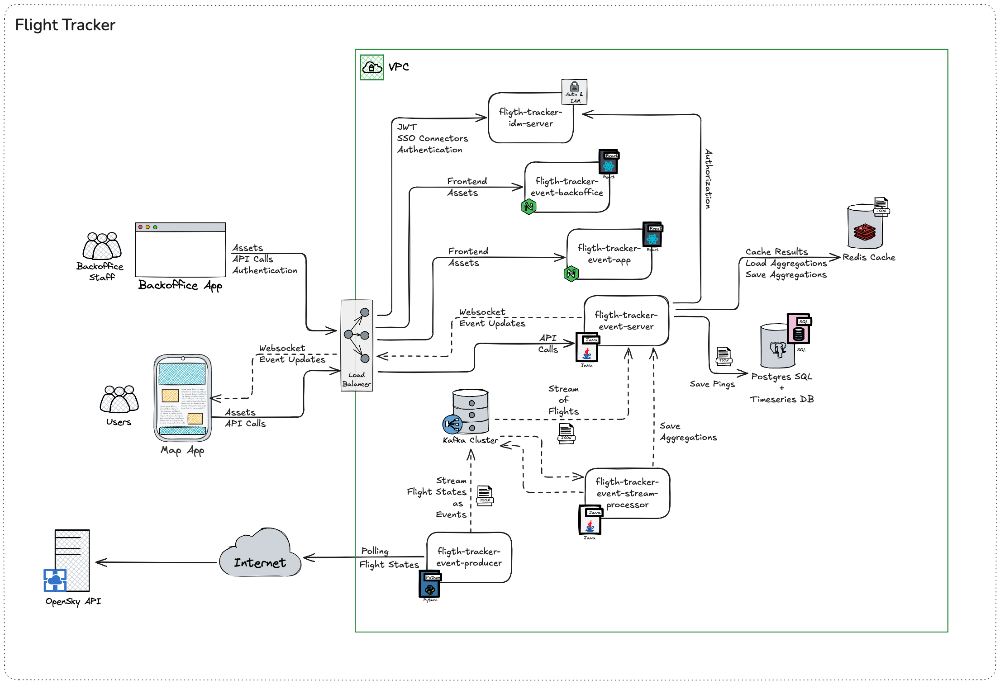

# Real-Time Flight Tracker


  

A distributed system for real-time flight tracking over Brazil, built with modern technologies and microservices architecture.

## Overview

  


  


  


This project implements a real-time flight tracking system that monitors aircraft movements over Brazilian airspace. The system processes flight data from OpenSky Network, performs real-time aggregations, and provides both user-facing and operational interfaces.



## Components

### Core Services

#### 1. flight-tracker-event-producer
- **Technology**: Python
- **Purpose**: Fetches real-time flight data from OpenSky Network API
- **Features**:
  - Configurable geographic boundaries for flight tracking
  - Kafka integration for event streaming
  - Docker support with crontab scheduling
- **Repository**: [flight-tracker-event-producer-python](https://github.com/luismr/flight-tracker-event-producer-python)

#### 2. flight-tracker-event-stream-processor
- **Technology**: Java 21 / SpringBoot
- **Purpose**: Generates and maintains flight tracking aggregations
- **Features**:
  - Real-time aggregations
  - Database updates
  - Performance optimizations

#### 3. flight-tracker-event-server
- **Technology**: Java 21 / SpringBoot
- **Purpose**: API and WebSocket server for flight tracking, validates and persists flight tracking events
- **Features**:
  - REST API endpoints
  - WebSocket broadcasting
  - Flight route history
  - Real-time flight status
  - Message validation
  - Database persistence
  - Event processing pipeline
- **Repository**: [flight-tracker-event-server-java](https://github.com/luismr/flight-tracker-event-server-java)

### Frontend Applications

#### 4. flight-tracker-event-app
- **Technology**: TypeScript / React
- **Purpose**: User-facing flight tracking map interface
- **Features**:
  - Real-time flight visualization
  - Interactive map controls
  - WebSocket updates
  - Mobile-responsive design

#### 5. flight-tracker-event-backoffice
- **Technology**: TypeScript / React
- **Purpose**: Operational dashboard for staff users
- **Features**:
  - Flight ping monitoring
  - Aggregation views
  - System metrics
  - Administrative controls

### Infrastructure

#### 6. flight-tracker-idm-server
- **Technology**: Keycloak
- **Purpose**: Identity and access management
- **Features**:
  - SSO support
  - JWT authentication
  - Role-based authorization
  - User management

#### 7. Data Stores
- **Kafka**: Event streaming platform
- **Postgres + TimescaleDB**: Time-series data storage
- **Redis**: Caching and real-time data

#### 8. External Services
- **OpenSky API**: Public flight data source

## Project Structure

```
realtime-flight-tracker/
├── flight-tracker-event-producer/          # Python OpenSky data fetcher
├── flight-tracker-event-stream-processor/  # Java stream processor
├── flight-tracker-event-server/            # Java API server & event consumer
├── flight-tracker-event-app/               # React user map app
├── flight-tracker-event-backoffice/        # React staff dashboard
├── flight-tracker-idm-server/              # Keycloak instance
├── docs/                                   # Documentation
├── img/                                    # Project images and diagrams
│   ├── arch_diagram_highlevel.png          # High-level architecture diagram
│   └── arch_diagram_highlevel.excalidraw   # Excalidraw source file
├── scripts/                                # Utility scripts
├── .gitignore                              # Git ignore rules for all submodules
├── LICENSE.md                              # MIT License
└── .gitmodules                             # Git submodules configuration
```

Note: Each submodule contains its own build and deployment configurations.

## Getting Started

### Prerequisites
- Git
- Docker and Docker Compose
- Java 21
- Maven 3+
- Python 3.9+
- Node.js 20+

### Initial Setup

1. Clone the main repository with submodules:
```bash
git clone --recursive git@github.com:luismr/realtime-flight-tracker.git
cd realtime-flight-tracker
```

2. Initialize and update submodules:
```bash
git submodule init
git submodule update
```

### Docker Compose Setup

The project uses multiple Docker Compose files to manage different aspects of the infrastructure:

1. **Base Network Setup** (`docker-compose.yml`):
   - Sets up the shared network for all services
   - Run first to create the network:
   ```bash
   docker-compose up -d
   ```

2. **Database Services** (`docker-compose-db.yml`):
   - PostgreSQL writer and reader instances
   - TimescaleDB for time-series data
   - Run with:
   ```bash
   docker-compose -f docker-compose-db.yml up -d
   ```

3. **Cache Services** (`docker-compose-cache.yml`):
   - Redis for caching and real-time data
   - Run with:
   ```bash
   docker-compose -f docker-compose-cache.yml up -d
   ```

4. **Streaming Services** (`docker-compose-stream.yml`):
   - Kafka cluster with 3 brokers
   - Kafdrop UI for Kafka management
   - Run with:
   ```bash
   docker-compose -f docker-compose-stream.yml up -d
   ```

5. **Backend Services** (`docker-compose.backend.yml`):
   - flight-tracker-event-producer
   - flight-tracker-event-stream-processor
   - flight-tracker-event-server
   - Run with:
   ```bash
   docker-compose -f docker-compose.backend.yml up -d
   ```

To start all services at once:
```bash
docker-compose -f docker-compose.yml \
  -f docker-compose-db.yml \
  -f docker-compose-cache.yml \
  -f docker-compose-stream.yml \
  -f docker-compose.backend.yml \
  up -d
```

To stop all services:
```bash
docker-compose -f docker-compose.yml \
  -f docker-compose-db.yml \
  -f docker-compose-cache.yml \
  -f docker-compose-stream.yml \
  -f docker-compose.backend.yml \
  down
```

**Note**: Make sure to set up your `.env` file with the required environment variables before starting the services. The `.env` file should include:
- PostgreSQL credentials
- Kafka cluster configuration
- OpenSky Network API credentials
- Other service-specific settings

### Public Server URLs

Once the services are running, you can access the following endpoints:

- **Kafdrop UI**: http://localhost:19000
  - Kafka cluster management interface
  - View topics, messages, and consumer groups
  - Monitor broker status and metrics

- **Kafka Brokers**:
  - Broker 1: localhost:19092
  - Broker 2: localhost:19093
  - Broker 3: localhost:19094
  - External access points for Kafka clients
  - Each broker is part of the cluster

- **PostgreSQL Writer**: localhost:5432
  - Primary database instance
  - Direct write operations

- **PostgreSQL Reader**: localhost:5433
  - Read replica instance
  - Read-only operations

- **Redis**: localhost:6379
  - Cache and real-time data access

### Working with Submodules

#### Update all submodules to latest
```bash
git submodule update --remote --merge
```

#### Checkout all submodules with latest changes
```bash
git submodule update --recursive --remote
```

#### Pull changes from main repository and submodules
```bash
git pull --recurse-submodules
```

#### Push changes to a submodule
```bash
cd <submodule-directory>
git add .
git commit -m "Update submodule"
git push
cd ..
git add <submodule-directory>
git commit -m "Update submodule reference"
git push
```

#### Check submodule status
```bash
git submodule status
```

#### Add a new submodule
```bash
# Add a submodule to the project
git submodule add <repository-url> <local-directory-path>

# Example - adding a new service
git submodule add git@github.com:username/new-service.git flight-tracker-new-service

# Update .gitmodules and commit
git add .gitmodules
git commit -m "Add new submodule: flight-tracker-new-service"
git push
```

## License

This project is licensed under the MIT License - see the [LICENSE.md](LICENSE.md) file for details.